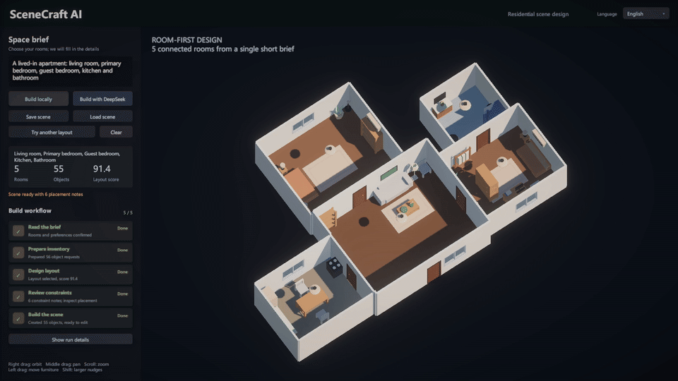
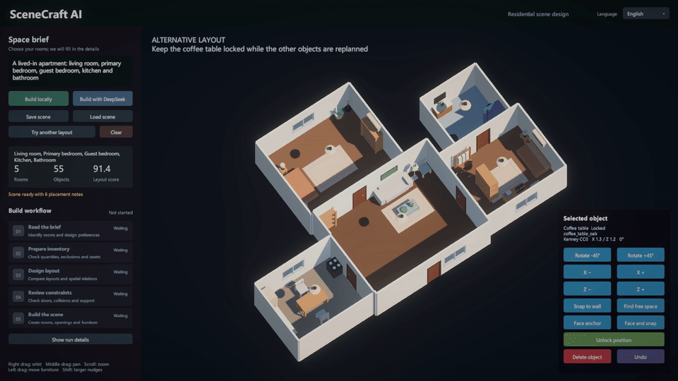
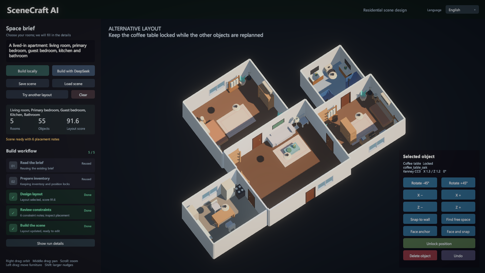
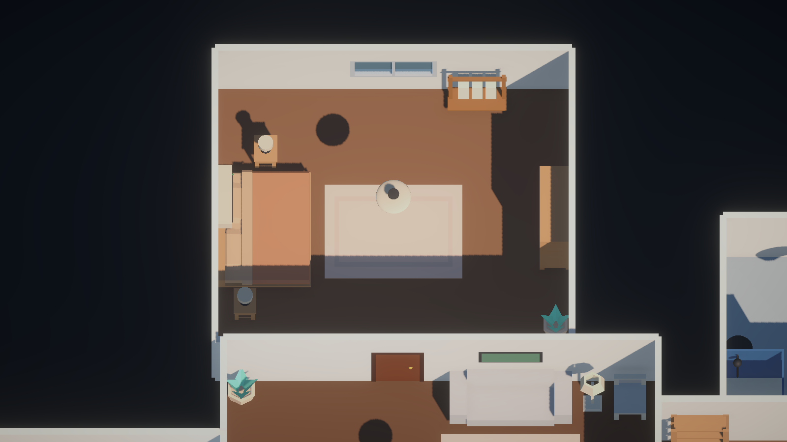
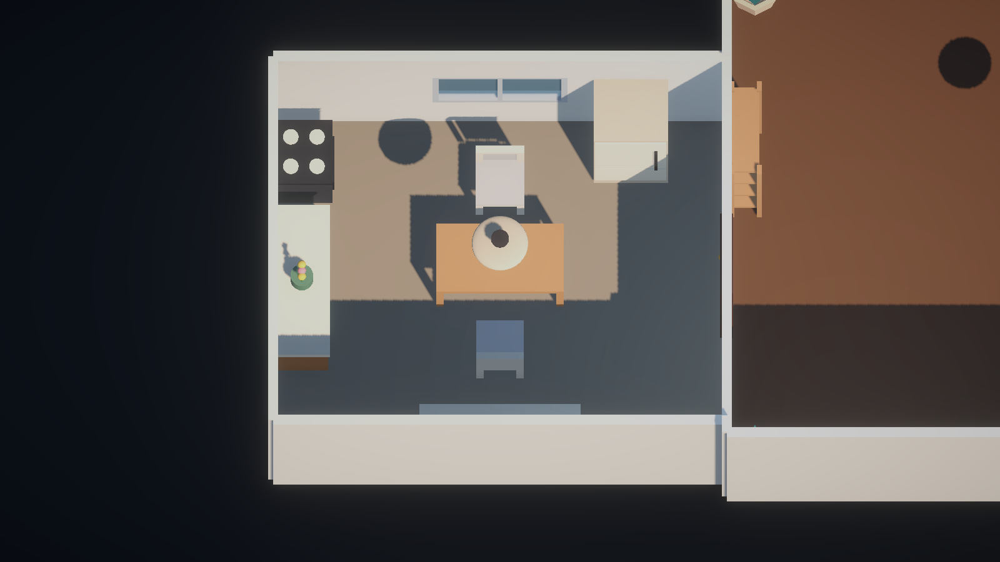
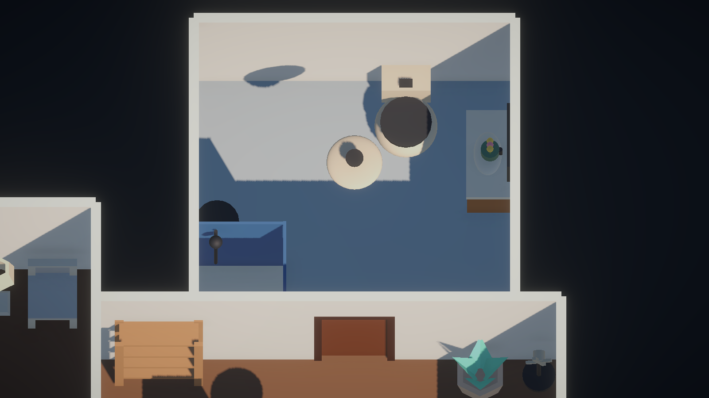
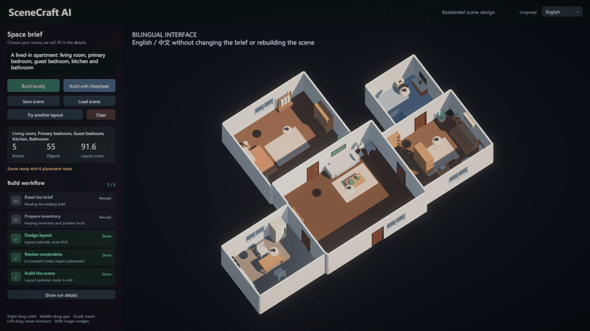

# SceneCraft AI · Unity URP

[English](#english) | [简体中文](#简体中文)

## English

A Unity scene-building portfolio project that turns a short room brief into a furnished, connected apartment. The default program contains a living room, primary bedroom, guest bedroom, kitchen and bathroom. Local rules handle assets and geometry; optional DeepSeek planning adds natural-language interpretation and a bounded semantic review.

The workflow is inspired by [SceneSmith](https://github.com/nepfaff/scenesmith). This is a smaller Unity/C# implementation, not a port or a feature-complete reproduction of the research system.



[Full demonstration](docs/media/scenecraft-demo.mp4) · [Apartment tour](docs/media/scenecraft-tour.mp4) · [Development](DEVELOPMENT.md) · [Plastic SCM history](docs/scm/HISTORY.md)

### Technical Highlights

| System | Implementation |
| --- | --- |
| Room-first design | Room types expand into role-specific inventories, with different primary/guest bedroom programs and dedicated kitchen/bathroom fixtures |
| Planning contract | A serializable `SceneSpec` keeps room IDs, quantities, exclusions, asset preferences, semantic anchors and placement data together |
| Connected architecture | Shared-wall ownership, reciprocal door openings, exterior-only window slots and overlap-range checks for unequal room sizes |
| Asset retrieval | 48 catalog definitions; exact asset/Prefab/FBX references take priority over category-filtered tag ranking |
| Staged placement | Floor, wall, ceiling and support-surface objects are placed separately, with room-local coordinates and anchor-first ordering |
| Candidate search | Four deterministic variants are scored for completion, relations, circulation, balance, connectivity and support; a novelty term favors different alternatives |
| Repair and inspection | Rotated-size bounds, opening clearance, furniture front space, support containment and coarse grid/graph reachability |
| Interactive editing | Validated drag/move, rotation, wall/anchor snapping, position locking, undo and local JSON save/load |
| Runtime UI | Event-driven workflow states and immediate English/Chinese switching, without changing the brief or rebuilding the scene |

The whole apartment has a staggered multi-wing outline. Individual rooms are still orthogonal zones; arbitrary polygonal rooms are not implemented. The asset library combines curated Kenney CC0 furniture with Unity-primitive fixtures and small objects, so no local neural 3D-generation model is required.

### Editing and Alternative Layouts

Move furniture within the placement constraints, undo the edit, then lock an object while searching for a different layout. The recordings invoke the same runtime operations as the controls; they are automated captures, not manual mouse recordings.



| Before | Alternative, with the coffee table locked |
| --- | --- |
|  |  |

[Furniture-editing recording](docs/media/scenecraft-edit.mp4) · [Alternative-layout recording](docs/media/scenecraft-layout.mp4)

### Room Details

| Primary bedroom | Kitchen | Bathroom |
| --- | --- | --- |
|  |  |  |

The examples use the actual generated scene. Scale variation and supported small objects provide detail without requiring a furniture list from the user.

### Run

1. Clone this repository and open its root in **Unity 2022.3.62f2**
2. Allow Package Manager to resolve **URP 14.0.12** and the recorded dependencies
3. Open `Assets/Scenes/SampleScene.unity` and press Play
4. Keep the default brief or enter your room types, then select **Build locally**

```text
A lived-in apartment: living room, primary bedroom, guest bedroom, kitchen and bathroom
```

For focused quantity tests:

```text
Create a living room. Only place one sofa, one coffee table, two plants and one vase.
Put the vase on the coffee table and the plants in different corners.
```

| Input | Action |
| --- | --- |
| Right mouse drag | Orbit the camera |
| Middle mouse drag | Pan the camera |
| Mouse wheel | Zoom |
| Left drag | Select and move furniture; invalid positions preview in red and revert |
| X/Z buttons | Move by 0.1 m; Shift-click uses 0.5 m |
| Try another layout | Replan unlocked objects from the current inventory |
| Language | Choose English or 中文; English is the initial default |

Language preferences are saved locally. Interface language does not restrict prompt language or translate the user's input. Expanded diagnostics preserve their original technical wording. Scene JSON is saved to `UserData/` in the Editor, or `SceneCraftData/` beside a standalone executable.



### Optional DeepSeek Planning

The project works without an API key. To use cloud planning, configure a Windows user environment variable named `DEEPSEEK_SCENECRAFTAI_APIKEY`, then fully restart Unity Hub and the Editor. Never place the key in source files, an Inspector field or a screenshot.

`SCENECRAFT_DEEPSEEK_MODEL` optionally overrides the model identifier used by the existing integration. Choose a model available to your DeepSeek account. Select **Build with DeepSeek** to request structured planning, followed by one bounded semantic Critic request. Explicit quantities and exclusions are reconciled locally; the Critic cannot add or remove the requested object set. Authentication, balance, network or parsing failures fall back to local planning.

The Critic receives scene data and four geometric text projections, **not rendered images**. Green workflow cards mean a stage finished; the separate audit notice can still report unresolved placement issues. The published recordings use local generation and make no paid API requests.

### Code and Evidence

| Topic | Entry point |
| --- | --- |
| Prompt intent and constraints | [PromptRules](Assets/SceneCraftAI/Scripts/Planning/PromptRules.cs), [HousePromptPlanner](Assets/SceneCraftAI/Scripts/Planning/HousePromptPlanner.cs) |
| Cloud protocol and review | [DeepSeekScenePlanner](Assets/SceneCraftAI/Scripts/Planning/DeepSeekScenePlanner.cs) |
| Asset identity and spatial metadata | [AssetCatalog](Assets/SceneCraftAI/Scripts/Assets/AssetCatalog.cs) |
| Placement and candidate evaluation | [SceneLayoutEngine](Assets/SceneCraftAI/Scripts/Layout/SceneLayoutEngine.cs), [SceneLayoutOptimizer](Assets/SceneCraftAI/Scripts/Layout/SceneLayoutOptimizer.cs) |
| Shared walls and openings | [RoomGeometry](Assets/SceneCraftAI/Scripts/Domain/RoomGeometry.cs), [RoomViewBuilder](Assets/SceneCraftAI/Scripts/Runtime/RoomViewBuilder.cs) |
| Scene ownership and edits | [SceneRuntimeController](Assets/SceneCraftAI/Scripts/Runtime/SceneRuntimeController.cs) |
| Interface and language | [SceneCraftHud](Assets/SceneCraftAI/Scripts/UI/SceneCraftHud.cs), [UiText](Assets/SceneCraftAI/Scripts/UI/UiText.cs) |

[Architecture](docs/ARCHITECTURE.md) · [Validation](docs/VALIDATION.md) · [Capture notes](docs/media/README.md) · [Scope compared with SceneSmith](SCENESMITH_PARITY.md)

### Current Scope

This is a constrained indoor design demo, not a general architectural CAD system. Dense scenes can contain missing placements or audit warnings. Local parsing covers a defined bilingual vocabulary; arbitrary language and design quality are not guaranteed. The circulation grid and graph checks are approximations, not full character navigation or physical settling.

Moving a support object that already carries small objects can be rejected by collision validation; automatic grouped movement of the support and its children is not implemented.

No FPS, speedup or VRAM-use benchmark is claimed. Removing local neural model generation makes the project suitable for testing on consumer hardware, but GPU memory use has not been profiled across devices.

### Development and References

Development used Unity Version Control / Plastic SCM. The `legacy-import` Git tag identifies this publication snapshot; actual earlier changesets are archived separately, without backdated Git commits.

- [SceneSmith](https://github.com/nepfaff/scenesmith): planning, retrieval, placement and critique workflow reference, MIT-licensed upstream
- [Kenney Furniture Kit](https://kenney.nl/assets/furniture-kit): curated furniture, CC0 1.0
- Unity packages retain their respective licenses

No blanket open-source license is granted to the original project code by this publication. The repository is provided for portfolio review. Third-party asset terms remain separate; see [THIRD_PARTY_NOTICES.md](THIRD_PARTY_NOTICES.md).

---

## 简体中文

一个 Unity 室内场景搭建作品集项目：输入简短的房间需求，自动生成相连的生活化住宅。默认包含客厅、主卧、次卧、厨房和卫生间。本地规则负责资产与几何布局，可选 DeepSeek 接口负责自然语言规划与一轮受控语义复查。

项目参考 [SceneSmith](https://github.com/nepfaff/scenesmith) 的规划、检索、摆放和检查流程，采用 Unity/C# 重新实现轻量版本，不是原项目移植，也不宣称完整复现其研究能力。


[完整演示视频](docs/media/scenecraft-demo.mp4) · [住宅巡视](docs/media/scenecraft-tour.mp4) · [开发归档](DEVELOPMENT.md) · [真实 SCM 历史](docs/scm/HISTORY.md)

### 核心技术

| 系统 | 实现方式 |
| --- | --- |
| 简化人工设计 | 只输入房间类型，自动扩展不同主次卧生活程序及厨卫设施，无需逐件罗列家具 |
| 结构化场景契约 | `SceneSpec` 统一保存房间 ID、数量、禁止项、资产偏好、语义锚点及摆放数据 |
| 连通户型 | 按共享区段确定墙体所有权，配对门洞世界坐标，窗户仅选择外墙，处理不同尺寸房间的连接 |
| 资产检索 | 48 项目录定义，精确资源/Prefab/FBX 引用优先于类别过滤后的关键词评分 |
| 分阶段摆放 | 地面、墙面、天花板、支撑面物件分别求解，使用房间局部坐标和锚点优先顺序 |
| 多候选优化 | 比较四个确定性方案，综合完成度、关系、通道、平衡、连接与支撑分数，换布局时加入差异性偏好 |
| 几何修正与审计 | 旋转后包围盒、门口避让、家具正面操作区、支撑面包含及粗粒度网格/图连通性 |
| 交互式编辑 | 校验拖动与微调，支持旋转、墙面/锚点吸附、位置锁定、撤销和 JSON 存取 |
| 事件驱动界面 | 展示真实流程状态，中英文即时切换，不改写输入或重新搭建场景 |

整套住宅采用错位多翼轮廓，不再是狭长矩形串联；单个房间仍为正交区域，尚未支持任意多边形房间。资产由 Kenney CC0 低模家具和 Unity 基础几何厨卫、生活小物件组成，不依赖本地神经网络生成 3D 模型。

### 功能展示


[家具移动与撤销](docs/media/scenecraft-edit.mp4) · [锁定后换布局](docs/media/scenecraft-layout.mp4)

上方房间细节截图展示主卧、厨房和卫生间。视频与 GIF 直接采集真实 Unity 运行画面，录制脚本调用与界面相同的编辑操作，并非人工鼠标录屏或合成效果图。

### 快速运行

1. 克隆仓库，用 **Unity 2022.3.62f2** 打开根目录
2. 等待 Package Manager 解析 **URP 14.0.12** 等依赖
3. 打开 `Assets/Scenes/SampleScene.unity`，进入 Play 模式
4. 保留默认英文房间列表，或在右上角 Language 切为中文后输入需求，点击本地生成

```text
一套生活化住宅：客厅、主卧、次卧、厨房和卫生间
```

右键拖动旋转视角，中键拖动平移，滚轮缩放，左键选择与拖动家具。X/Z 按钮每次移动 0.1 米，Shift 点击使用 0.5 米；无效位置会显示红色并在释放时回退。锁定位置后，换布局会保留该家具并重新安排未锁定物件。

界面首次默认英文，之后记住本机语言选择。界面语言不限制提示词语言，也不会自动翻译用户输入。展开的运行记录保留原始技术文字。编辑器 JSON 存于项目 `UserData/`，独立程序存于可执行文件旁的 `SceneCraftData/`。

### DeepSeek 接口

离线运行无需 Key。云端规划需要设置 Windows 用户环境变量 `DEEPSEEK_SCENECRAFTAI_APIKEY`，然后完整重启 Unity Hub 和编辑器。不要将 Key 放进源码、Inspector 或截图。

`SCENECRAFT_DEEPSEEK_MODEL` 可覆盖当前接口使用的模型标识，应选择账号可用模型。DeepSeek 先返回结构化规划，本地完成布局，再进行最多一轮语义复查。数量和禁止项由本地规则再次核对，Critic 不得增删请求物件。认证、余额、网络或解析失败时降级为本地设计。

当前 Critic 输入的是场景数据和四向几何文字投影，**不是视觉大模型截图检查**。流程变绿表示阶段完成，不代表所有摆放约束均通过；独立审计提醒仍会显示问题。本次公开演示全部采用本地生成，没有消耗 API 额度。

### 验证与边界

[架构说明](docs/ARCHITECTURE.md) · [验证记录](docs/VALIDATION.md) · [录制说明](docs/media/README.md) · [与 SceneSmith 的能力边界](SCENESMITH_PARITY.md)

这是有约束的室内设计演示，不是通用建筑 CAD。密集场景仍可能有未放入的对象及审计提醒；离线语义解析使用有限中英文词表，不保证任意表达和审美质量。粗网格通行检查也不等同于完整角色寻路或物理稳定性模拟。

移动已经承载小物件的桌子等支撑体时，碰撞校验可能拒绝操作；尚未实现支撑体与上方物件的整体移动。

项目没有宣称未经测量的 FPS、性能提升或显存占用。省去本地神经 3D 生成降低了使用门槛，但尚未完成跨显卡显存基准测试。

### 开发归档与来源

开发阶段使用 Unity Version Control / Plastic SCM，`legacy-import` 标记本次公开快照，早期真实 changeset 单独归档，没有伪造过去的 Git 提交。

参考 SceneSmith 的系统流程；家具资源来自 Kenney Furniture Kit（CC0 1.0）。Unity 包遵循各自许可。公开仓库尚未为原创代码授予统一开源许可证，用于作品集审阅；第三方资源许可独立保留，详见 [资源说明](THIRD_PARTY_NOTICES.md)。
