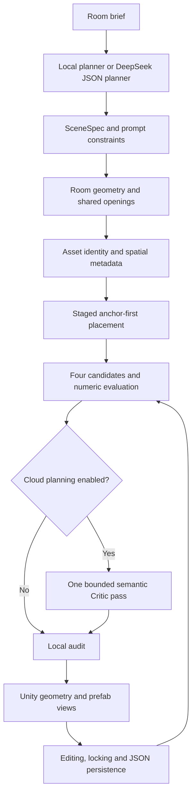

# Architecture / 架构

## English

`SceneRuntimeController` owns the active scene and build progress. Planners produce serializable data; geometry and layout systems modify that data; views and the HUD observe it. No model weights are loaded locally by this pipeline.

### Data, Assets and Coordinates

`SceneSpec` stores rooms, connections, requests and placements. Object IDs and room assignments link semantic anchors to their support objects. World-space room centers and room-local placement checks are converted at the runtime/layout boundary.

The catalog has 48 definitions and 29 curated mappings to 28 unique Kenney source-model prefabs. Exact source names and asset aliases bypass tag ranking, subject to category compatibility. Missing curated mappings fall back to primitive geometry. Identity, dimensions and palette are separate to avoid treating a filename's historical color suffix as a visual guarantee.

### Geometry and Placement

Room dimensions are normalized before adjacency. Shared overlap ranges determine one wall-rendering owner; reciprocal openings must agree in world space. Exterior window slots subtract neighboring wall overlaps and existing openings. A 0.025 m gap permits near-wall furniture without intersecting wall geometry.

Placement checks use axis-aligned bounds expanded for yaw, rather than exact mesh collision or an oriented-box separating-axis solver. Rugs/support relationships receive special treatment. Separate clearance zones represent entrances and operating space. These approximations can be conservative and are a known source of dense-layout limitations.

### Candidate Evaluation

| Term | Maximum contribution |
| --- | --- |
| Requested-object completion | 35 |
| Semantic relations | 25 |
| Room circulation | 15 |
| Spatial balance | 10 |
| House connectivity | 10 |
| Support containment | 5 |

Four seeded variants are evaluated. Alternative-layout selection adds a novelty preference while preserving locked requests. The circulation check uses a 0.4 m room grid; house connectivity verifies graph edges against paired openings. The displayed score is this project's heuristic, not a SceneSmith benchmark or a guarantee of livability.

### Cloud and Presentation Boundaries

The optional Planner requests JSON through `UnityWebRequest`. Local reconciliation enforces explicit quantities, exclusions and asset locks after planning and retrieval. The Critic sees scene state, numeric scores and four geometric text projections; its proposed inventory must match the original. Errors retain a local result and surface an honest fallback note.

The controller emits actual stage transitions. The HUD localizes controlled labels and progress arguments rather than interpreting log strings; language switching modifies presentation, not scene ownership. Completed checks and passed constraints are deliberately separate states.

The capture utility is command-line gated and invokes the same runtime edits. It changes camera framing and temporarily hides the empty selection panel/whole HUD for scene-detail shots. It does not replace geometry or synthesize images.

## 简体中文

`SceneRuntimeController` 持有当前场景与生成进度，规划器产生可序列化数据，几何/布局系统修改数据，视图与 HUD 观察状态。整个流程不在本地加载模型权重。

`SceneSpec` 用对象 ID、房间归属和锚点串起数量、检索、支撑与摆放。48 项目录包含 29 个 Kenney 映射，对应 28 个独立源模型 Prefab；精确资源引用优先，缺失时使用基础几何兜底。

尺寸先归一化，再计算邻接与共享墙区段。相邻房间只渲染一份共享墙，门洞采用一致世界坐标，窗户扣除内墙和已有洞口。贴墙间隙为 0.025 米。碰撞使用随 yaw 扩展的轴对齐包围盒，不是精确网格碰撞或 OBB 分离轴求解，密集场景可能偏保守。

四个候选方案按完成度 35、关系 25、通道 15、平衡 10、连接 10、支撑 5 加权评分；换布局加入差异性偏好并保留锁定物件。通道检查使用 0.4 米房间网格，连接评分核对配对门洞。此分数是项目启发式，不是 SceneSmith 基准，也不能保证居住合理性。

DeepSeek 负责 JSON 规划及最多一轮语义复查。本地再次核对显式数量、禁止项和资源锁；Critic 输入为几何文字投影，不能增删物件清单。失败保留本地结果并显示降级信息。

生成进度来自真实事件。HUD 只翻译受控文案和参数，语言切换不改变权威场景；检查阶段完成与约束全部通过分别展示。录制工具只自动调用真实操作，改变观察角度，并为细节截图暂时隐藏 HUD，没有替换场景几何或合成图像。
